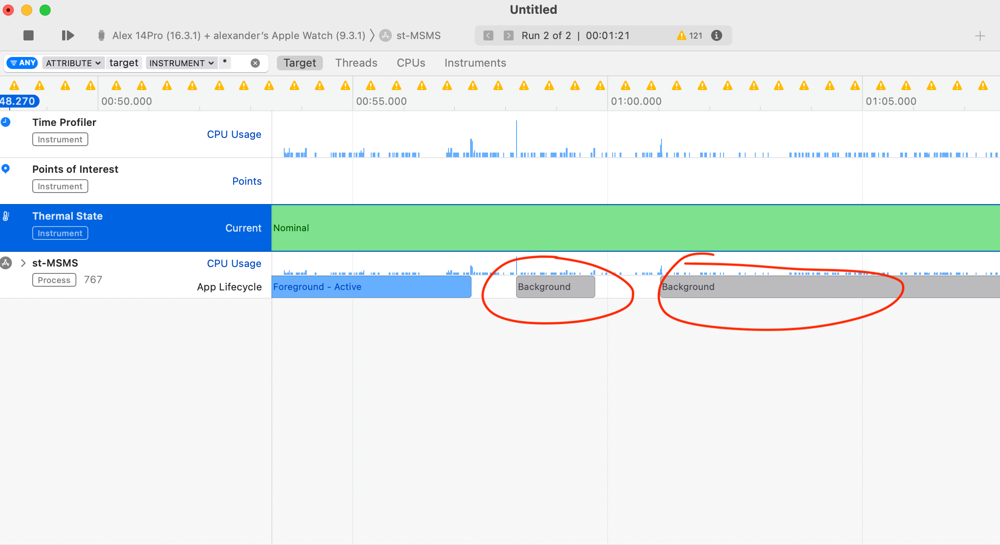

autoscale: true

### (not) using Apple Watch as a Medical Device

^ name is alex; I work as an engineer on integrating Computer Vision technologies into mobile applications, and, I do this for a company called Jumio

--- 

#### ~~(not) using Apple Watch as a Medical Device~~
### WatchOS apps as *SaMD

###### **Software as a medical device*

^ SaMD is defined by FDA, the main regulation body for Pharma in US

--- 

#### ~~(not) using Apple Watch as a Medical Device~~
### ~~WatchOS apps as SaMD~~
## the bad, the worse, and the terrible of *WatchOS* background execution


^ name is alex; I work as an engineer on integrating Computer Vision technologies into mobile applications, and, I do this for a company called Jumio
___


### clinical trials */* therapeutic session monitoring system


^ this is a case study about: talk about clinical trials; talk about covid; talk about how apple watch are the main point 

---

## Why apple watch?

[.text: alignment(left)]

*|* price

*|* availability (* during a pandemic)

*|* access to (the most of the ) raw sensors

*|* correlation of data to a standardized measure device ->


---
#### HR Data Correlation


*|* source:  "The Quantified Scientist" https://www.youtube.com/watch?v=u8XbiWIUW4s

---

## access to raw sensors
```swift

    // ACCELEROMETERY TRACKING
    private func startAccelerometryTracking(using queue: OperationQueue) {
        if motionManager.isAccelerometerAvailable {
            let accelerometryCSVFileName = getDocumentsDirectory().appendingPathComponent("tmp/\(dataRecordingID).\(CONFIG.accelerometryExtensionName)")
            let accelerometryCSVHeader = "timestamp,timestamp_from_sensor,x,y,z\n"
            do {
                try accelerometryCSVHeader.write(to: accelerometryCSVFileName, atomically: true, encoding: String.Encoding.utf8)
                accelerometryCSVFile = FileHandle(forUpdatingAtPath: accelerometryCSVFileName.path)
                var firstTimestamp: TimeInterval?

                motionManager.startAccelerometerUpdates(to: queue) { (data, error) in
                    if let accData = data, self.motionManager.isAccelerometerActive {
                        // for watch, using a dateFormatted string causes CPU usage 
                        // over 20% (which causes our workoutSession to be terminated); to avoid this, we use simple epoch time
                        if firstTimestamp == nil {
                            firstTimestamp = accData.timestamp
                        }
                        let timestamp = accData.timestamp - firstTimestamp!
                        let dataString = "\(timestamp),\(accData.timestamp),\(accData.acceleration.x),\(accData.acceleration.y),\(accData.acceleration.z)\n"
                        writeDataToFile(
                            file: self.accelerometryCSVFile,
                        ...
                        ...
    }
```
---


### The problem




^ static let activityType = HKWorkoutActivityType.running .indoor
problem je, ze ked odvratite zapastie, aplikacia je suspendovana do pozadia, 

___


# *HKWorkoutSession* to the rescue

```swift

    func triggerWorkout() {
        self.configuration = HKWorkoutConfiguration()
        self.configuration.activityType = SharedConstants.activityType
        self.configuration.locationType = SharedConstants.locationType

        do {
            self.session = try HKWorkoutSession(healthStore: self.healthStore, 
                                              configuration: self.configuration)
            self.builder = self.session.associatedWorkoutBuilder()
        } catch {
            ...
        }
    }
```

^ static let activityType = HKWorkoutActivityType.running
^ static let locationType = HKWorkoutSessionLocationType.indoor
___


## real-time Heart rate collection

```swift

    func workoutBuilder(_ workoutBuilder: HKLiveWorkoutBuilder, didCollectDataOf collectedTypes: Set<HKSampleType>) {
        if  !(shouldForwardContinousHeartRate || shouldForwardMomentaryHeartRate) { return }

        for type in collectedTypes {
            guard let quantityType = type as? HKQuantityType, 
                      quantityType == HKQuantityType.quantityType(forIdentifier: .heartRate) else {
                return // Nothing to do.
            }
            ...
        }
    }
```
---


### watch out for *cpu usage spikes*


^ hovor o batch uploadoch, ktore su predtym zipovane; ked je device dlho offline, nahromadi sa vela suborov, ktore ked sa naraz zacnu zipovat, je cpu spike

___


## CPU Usage limitations

[.text: alignment(left)]

*|* Do not use over *15% of CPU capacity* for more than *50 seconds*, or else

*|* always optimise any CPU-intensive routines / segment any batch processing jobs

___

## *HKWorkoutSession* only works from  a user input


---


## Final Thoughs

[.text: alignment(left)]

*|* all things considered, Apple Watch is an incredible product (nowadays)

*|* let's discuss

*|* dik dik dik

